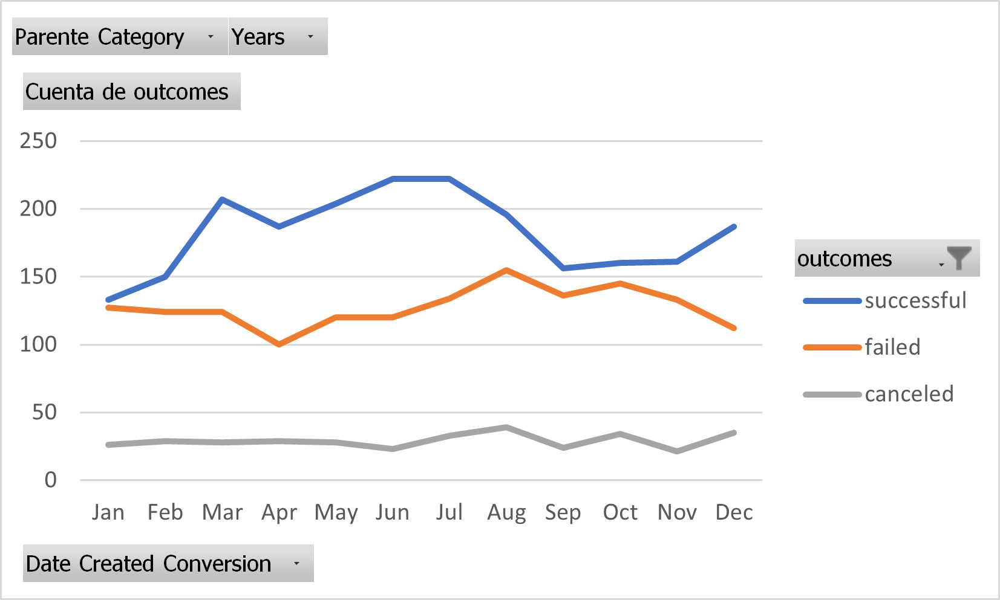
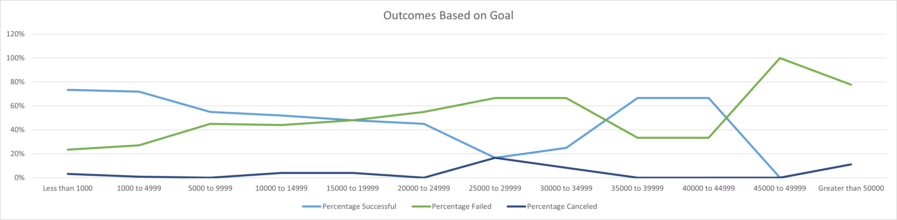

# Kickstarting with Excel

## Overview of Project
Luise wants help to make a cofounding campaign for her play Fever. 
### Purpose
Give the characteristic for the better scenario for launch the player Fever
## Analysis and Challenges
The best countries for making the cofounding campaign are the US and GB, the best goal is under 5,000 dollars and the best months for launching the play are June, July, and August.
### Analysis of Outcomes Based on Launch Date
The best months for launching are June, July, and August. The worst months are November, December, January, and February. But the worst in January.

### Analysis of Outcomes Based on Goals
The best range for fix a goal are $1000 to $4999

### Challenges and Difficulties Encountered
It's the first analysis of data for me, and I´m don't know much about the entertainment sector. 
## Results

- What are two conclusions you can draw about the Outcomes based on Launch Date?

Spring, Summer, and Fall are goods seasons for having success in the play.

The cold weather makes the market for entertainment down. 

- What can you conclude about the Outcomes based on Goals?

Have low expectations is better. 

- What are some limitations of this dataset?
We need to know the business for making the right conclusion. 

- What are some other possible tables and/or graphs that we could create?

Glad to know the data for country and type of player. 